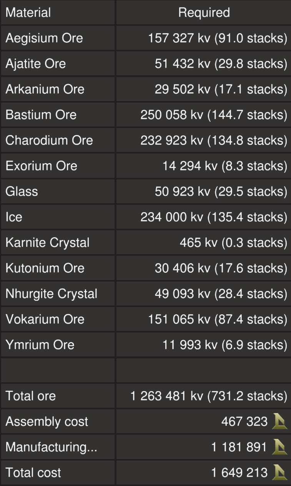
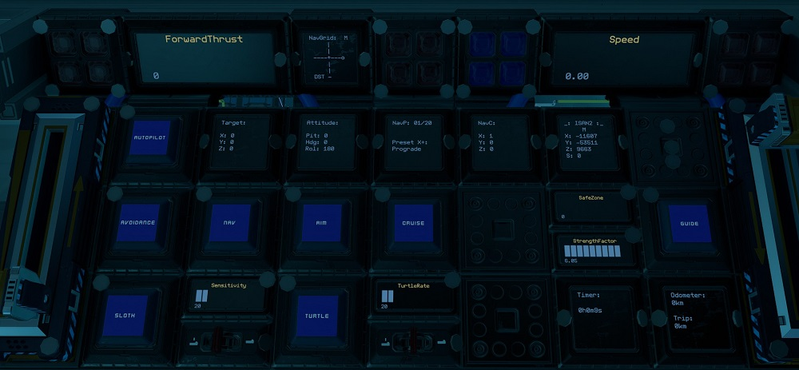
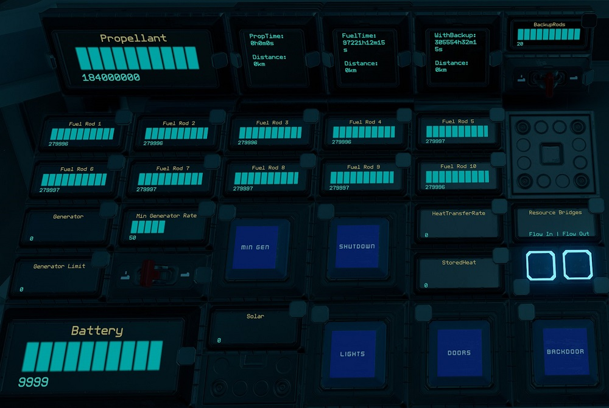

# Quester by EGOTech

The Quester multi purpose command or explorer ship that is fitted with a medbay with a reconstruction machine and a workshop with all three crafting benches.
It also has a large main hall that is designed to be large enough to fit the capital ship nav logger (not included in blueprint). However the owner is free to fit the hall for whatever purpose that is desired.
The blueprint is provided for [free](#download-blueprint). All [feedback](#providing-feedback) is welcome and in game tips (in-game name Egomaniac) are appreciated. However support will be limited but I will try my best.

[Starbase Ship Shop Page](https://sb-creators.org/makers/Egomaniac/ship/%5BFREE%5D%20Quester)

  
  
  
  
  
  
  

More photos in the [`photos` folder](photos)

## Features

The ship has the following features:

- Spacious interior with large main hall ready to be fitted
- Two additional seats for co-pilots in a large open bridge
- Workshop with all three crafting benches and three resource bridges
- Medbay with a reconstruction machine
- 24 ore crates to store ore for refills
- Standard Cruise function
- Turtle and Sloth functions with adjustable rates
- Transponder system with ping function
- Two external and four internal resource bridges
- Solar panels which can generate up to 4,300 EPS of power
- Auto generator rate script with adjustable minimum rate
- 30 T2 generators with 10 T2 fuel chambers and 20 spare rods on racks
- 16 large and 40 small propellant tanks with 232,000,000 units of propellant
- Estimated propellant time of 13 hours and range of 6,500km
- Propellant time and fuel time panels
- 72 batteries
- 36 T2 box and 124 T2 triangle thrusters, all with T3 nozzles providing forward thrust
- 36 T2 triangle thrusters with T3 nozzles providing braking thrust
- 48 T2 triangle thrusters with T3 nozzles for maneuvers
- Extra two small propellant tank with its own resource bridge for emergency refueling
- Eight extra hardpoints (all cabled and piped)
- [NavGrid by StandPeter](https://github.com/pcbennion/starbase-navgrid)
- [NavCas by fixerid](https://github.com/fixerid/sb-projects/tree/main/NavCas), using custom avoidance system and ISAN 3 in 1 from [Compass by Firestar99](https://gitlab.com/Firestar99/yolol/-/blob/master/src/compass/README.md), with ability to load target from NavGrid
- Warning lights and alarm for obstacle detection and avoidance, powered by 44 rangefinders
- Speedometer
- Timer panel
- Odometer panel
- Many extra slots for YOLOL or memory chips
- Top speed of 130m/s before main hall is fitted

## Changelog

### v1.1.1 (Current) - 11/06/2022

- Removed unused speedo chip
- Fixed max propellant on engineering console
- Added meter upgrade to basic crafting bench

### v1.1.0 - 26/05/2022

- Painted thrusters black and nozzles red
- Removed some useless bolts that were sticking out
- Added 10 heat sinks
- Reduced radiators to four bases and eight extensions
- Replaced all `RadiationRate` panels with `HeatTransferRate`
- Added `StoredHeat` panels
- Replaced cargo lock frame speedometer with new speedometer
- Increased max propellant to 232,000,000
- Removed fast travel core

### v1.0.4 - 07/01/2022

- Fixed reconstruction machine not assembled correctly

### v1.0.3 - 04/01/2022

- Added reset buttons for timer, odometer and avoids as current method does not work with duplicate panels

### v1.0.2 - 31/12/2021

- Replaced braking thrusters' nozzles with T3 nozzles as originally intended
- Removed `nName`, `nX`, `nY` and `nZ` panels from navigation co-pilot console as duplicates interfere with operation

### v1.0.1 - 25/12/2021

- Fixed centering speed for `FcuBackward` lever
- Added missing `Fuel` variable to memory chip to fix fuel time panel
- Added solar panels to generator room

### v1.0.0 - 22/12/2021

- Initial release

## Build Cost

TIP: You can craft your own crates, generators (T2), box and triangle thruster components (T2 with T3 nozzles) and ship tools to reduce assembly cost.

## Download Blueprint

The blueprint file is available in the `blueprints` folder [here](https://github.com/vinteo/starbase-ships/raw/main/quester/blueprints/quester.fbe).

## Known Issues

- There is limited coverage of range finders for the crash avoidance system. **Use at your own risk!**
- Autopilot doesn't seem to point ship directly to destination (a bit off), use in conjunction with NavGrid.
- Depending on how the main hall is fitted, the thrust efficiency may be affected causing slightly slower speeds

## Usage

To enter the ship, there are buttons on either sides of the ship just behind the cockpit that will open `Doors`. There are also buttons which open `Backdoor` on either side towards the back of the ship.

### Flying the Ship

The left lever on the center console controls backwards thrust (braking) and the right lever controls forward thrust.

| Interface | Function |
|---|---|
| `Speed` | Current speed in metres per second.|
| `ForwardThrust` | Current forward thrust, maximum of 10,000 units |
| `Cruise` | Activates cruise control, forward thrust will not reset to zero unless turned down. |
| `Turtle` | Activates turtle mode which sets forward thrust to a maximum limit of `TurtleRate` of full thrust. |
| `Sloth` | Activates the low sensitvity mode of pitch and yaw by limiting thrust. Use the `Sensitivity` switch to set the maximum thrust rate of sloth mode.|
| `Aim` | Reduces the response time of key presses for pitch and yaw. |
| `Guides` | Activates rangefinders (except center one which can be activated separately). Can be used as guide lasers. `Red` warning lights show location of obstacles (left, right and centre). |
| `Nav`, `Autopilot`, `Avoidance` & `Target` | Autopilot controls. See [Autopilot and Crash Avoidance](#auto-pilot-and-crash-avoidance). |
| `ISAN2` | Current ISAN coordinates of ship. |
| `NavGrid`, `NavP`, `NavC` & `Attitude` | [NavGrid](https://github.com/pcbennion/starbase-navgrid) system, see [Using the Waypoint System](#using-the-waypoint-system). |
| `SafeZone` | Whether current location is in the safe zone. |
| `StrengthFactor` | Current strength of ship. May fluctuate as ore crates are filled. Anything below 1.0 means ship is damaged. |
| Transponder `Toggle` & `Ping` | Transponder controls, `Toggle` turns on and off ship transponder while `Ping` will activate transponder for three seconds |
| `Timer` | See [Timer](#timer). |
| `Odometer` | See [Odometer](#odometer). |

### Using the Waypoint System

#### Viewing and Selecting Waypoints

This uses the [NavGrid](https://github.com/pcbennion/starbase-navgrid) system. Use the `Down` and `Up` waypoints selectors to select waypoint. The selected waypoint information is shown on `NavP` and `NavC` panels.

On the pilot center console, `NavGrid` will show the compass towards the selected waypoint while `Attitude` will show the ship's pitch, heading and roll directions. `NavGrid` is best used while not moving.

#### Editing and Saving Waypoints

Use `Set` to save waypoint of current location to the current selected waypoint position.

To edit currently selected waypoint, use your `U` tool to add name, X, Y and Z values to `nName`, `nX`, `nY` and `nZ` respectively. Then use the `Save` button to save.

**NOTE:** Waypoint 1 to 6 are presets and can not be over written.

#### Loading Waypoint to Auto Pilot

Use `Load to Auto Pilot` to load curretnly selected waypoint to `Target` to be used with the auto pilot system.

### Auto Pilot and Crash Avoidance

The ship uses a modified version of [NavCas](https://github.com/fixerid/sb-projects/tree/main/NavCas) which uses the 3 in 1 ISAN from Compass. Waypoints are loaded from NavGrid waypoint system.

Use while the ship is stationary. Activating `Nav` will start point the ship towards `Target` waypoint and deactivate itself when done. `Autopilot` will activate `Nav` and fly to within 5km of `Target` waypoint with `Avoidance` activated.

**NOTE:** `Nav` may not be very accurate. I recommend using it in conjunction with the NavGrid compass. The `dd` panel on the pilot left console shows debugging information for NavCas.

`Avoidance` will activate `Guides`. If the guides detect objects it will cut thrust and strafe up or down (will flash either the top or bottom `Blue` warning lights on the pilot center console according to the direction) while sounding an alarm (check game settings if you do not hear the alarm).
It will also flash `Red` warning lights on the pilot center console according to the position of obstacle detected. If `Autopilot` is activated, it will readjust and continue its flight.

`Avoids` will show the counters for number of avoidances. The `Trip` counter can be reset by holding down the `Avoids` `Reset Trips` button.

**NOTE:** There is very limited coverage of range finders for the crash avoidance system. **Use at your own risk!**

### Resetting Navigation

If ISAN or NavGrid is not working, it can be reset using the `Reset ISAN` button. Press once to take ISAN offline, then press again to reset.

### Managing Power and Fuel

| Interface | Function |
|---|---|
| `Propellant` | Total propellant remaining in propellant tanks, maximum of 232,000,000 units. |
| `PropTime` | Time and distance remaining of propellant based on current usage. Distance is calculated from speed, so speedometer must be activated. |
| `FuelTime` | Time and distance remaining of fuel based on current usage. Distance is calculated from speed, so speedometer must be activated. |
| `WithBackup` | Same as FuelTime but takes into account backup rods available. Use the switch for `Backup Rods` to set the number of backup rods available. As standard there are 20 extra rods. |
| `Fuel Rod 1` to `Fuel Rod 10` | Fuel remaining on fuel rods in individual fuel chambers, maximum of 300,000 units for each. |
| `Generator` | Current generator rate, maximum of `Generator Limit`. |
| `Min Gen` & `Min Generator Limit` | Toggle and sets minimum generator rate. See [Managing Power](#managing-power). |
| `Shutdown` | Will turn off all fuel chambers thus shutting down generators. |
| `Battery` | Shows current battery charge of the 40 batteries, maximum of 10,000 units. |
| `Solar` | Current pwoer generated by the solar panels, in EPS, up to a maximum of 4,300 EPS |
| `HeatTransferRate` | Current heat transfer rate of the heat sinks, maximum of 100%. |
| `StoredHeat` | Current stored heat in the heat sinks, maximum of 15,000 units. |
| `Flow In` & `Flow Out` | Toggle flow modes of resource bridges. See [Refueling Propellant](#refueling-propellant). |
| `Lights` | Turns on and off internal lights. |
| `Doors` | Opens or closes ship entry doors. |
| `Backdoor` | Opens or closes ship back doors. |

#### Managing Power

By default the generator will only run and ramp up when the batteries need charging so there is minimum management needed. But you can set a minimum generate rate by setting the `Min Generator Limit` value using the switch for the minimum rate and turning on `Min Gen`.

#### Refueling Propellant

All four resource bridges can be used for refuelling propellant. To refuel from another ship, turn off `Flow Out` on the pilot right side console and leave `Flow In` turned on. Then connect a resource bridge to the other ship. To refuel another ship, do the opposite, `Flow Out` turned on and `Flow In` turned off.

The two red propellant tanks in the back maintenance room can also be used to refuel the ship. Connect the `Red` resource bridge to the `Green` resource bridge to tarnsfer propellant. You can then unbolt the red tanks and craft refills for the tanks using ice and then bolt the tank back to the support. Rinse and repeat until full. The `Red` and `Green` buttons toggles the respective resource bridges.

Remember to turn `Flow In` and `Flow Out` back on if you are using the Endo to collect ore via any of the ship's resource bridges.

### Other Stuff

#### Timer

On the pilot center console there is a `Timer` panel which acts as a timer. It will run when the ship is active and show total time in years, weeks, days, hours, minutes and seconds. To reset the timer, hold down the `Reset Timer` button on the pilot left console.

#### Odometer

On the pilot center console there is a `Odometer` panel which will keep track of the ship's estimated flight distance based on speed (speedometer must be activated). To reset the trip odometer, hold down the `Odometer` `Reset Trips` button on the pilot left console.

## Providing Feedback

I can be found in-game as Egomaniac and on discord as vinteo#4211. Feel free to contact me and provide feedback or if you need help. Pull requests are also welcomed for scripts changes/fixes.

I would also love to see any modifications or improvements you have made, so feel free to share! I hope to learn from the community and may also incorporate your changes into future versions.

Of course in-game tips are greatly appreciated.

## Frequently Asked Questions

### Can I sell ships based on this blueprint?

No.

### Why can't the crafting bench craft T2 refills?

You need to bolt a meter upgrade to the bench. The ship designer doesn't provide it so I couldn't add it to the blueprint.

### Why does NavGrid show an error?

This usually happens after travelling to the moon via the warp gate where ISAN is not available. After returning, this can be fixed by reseting ISAN. See [Resetting Navigation](#resetting-navigation).

## Designed by EGOTech

